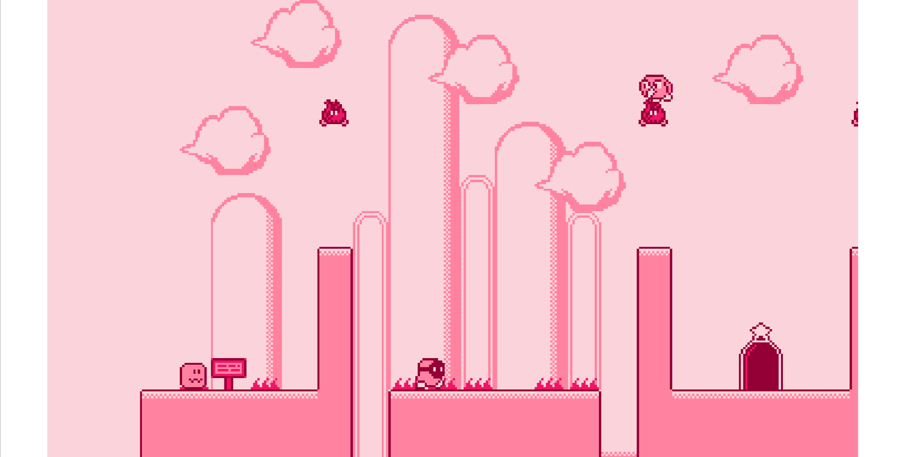
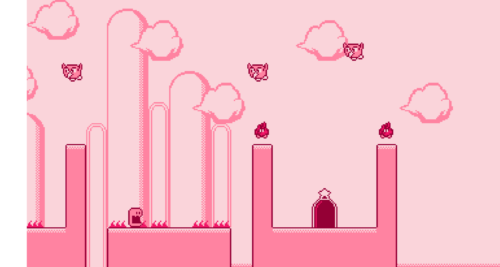

# Kirby Game - Built Using Kaboom.js and TypeScript

Welcome to the Kirby Game! This is a simple, fun game where you control Kirby to move, jump, and inhale enemies and shooting stars. 

## Images

<table>
  <tr>
    <td></td>
    <td></td>
  </tr>
</table>

## Controls

- **Z**: Inhale enemies and release to shoot as star
- **Space**: Jump
- **Left Arrow or J**: Move Left
- **Right Arrow or L**: Move Right

## Levels

There are currently two levels available in the game.

You can create new levels using [Tiled | Flexible Level Editor](https://www.mapeditor.org/) and use components from `./public/kirby-like.png`

## Development

### Prerequisites

- Node.js
- npm (Node Package Manager)

### Installation

1. Clone the repository:
    ```sh
    git clone https://github.com/Aman1337g/Kirby-Kaboom-Quest.git
    cd kirby-game
    ```

2. Install the dependencies:
    ```sh
    npm install
    ```

3. Start the development server:
    ```sh
    npm run dev
    ```

4. Build the project:
    ```sh
    npm run build
    ```

### Docker Deployment

You can also deploy the project using Docker. Follow these steps:

1. Build the Docker image:
    ```sh
    docker build -t kirby-game .
    ```

2. Run the Docker container:
    ```sh
    docker run --rm --detach -p 80:80 kirby-game
    ```

This will build and run the game on port 80 of your localhost.

## License

This project is licensed under the MIT License. See the [LICENSE](LICENSE) file for details.

## Contributing

Feel free to submit issues and pull requests. Contributions are welcome!